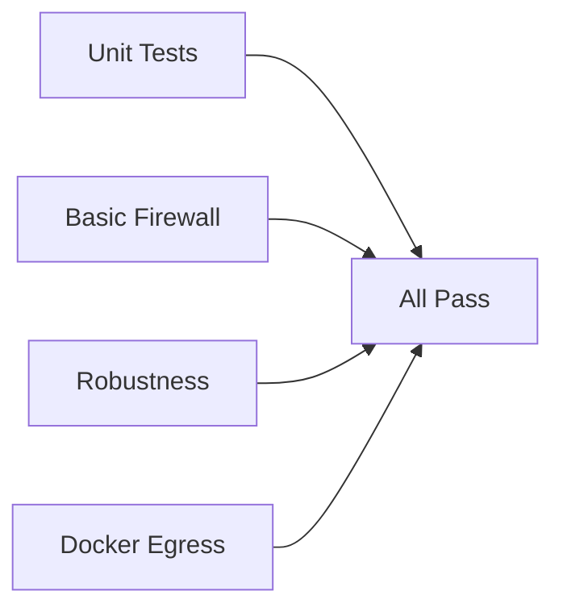

A comprehensive assessment of the Agentic Workflow Firewall (AWF) project's CI/CD infrastructure and testing practices.

## Executive Summary

The AWF project has established a solid foundation for continuous integration and deployment with dedicated workflows for testing, coverage reporting, release automation, and documentation. However, there are opportunities to enhance security scanning, improve test coverage for critical modules, and add additional test types.

**Overall Grade:** B

| Area | Score | Notes |
|------|-------|-------|
| Workflow Design | A | Well-structured, modular workflows with artifact preservation |
| Test Coverage | C+ | Good coverage for some modules, significant gaps in core files |
| Security Testing | C | Threat detection exists, but lacks dedicated SAST/DAST |
| Release Automation | A | Comprehensive with signing, SBOM, and checksums |
| Documentation | A | Dedicated docs workflow with Astro Starlight |

## Current State Assessment

### Workflows Overview

The project contains 7 GitHub Actions workflows in `.github/workflows/`:

| Workflow | Purpose | Triggers | Timeout |
|----------|---------|----------|---------|
| `test-integration.yml` | Main testing pipeline | push/PR to main | 5-10 min |
| `test-coverage.yml` | Coverage reporting | push/PR to main | 10 min |
| `test-claude.yml` | Claude Code integration | push/PR to main | 15 min |
| `pr-title.yml` | Conventional commits enforcement | PR events | — |
| `release.yml` | Release automation | version tags | — |
| `deploy-docs.yml` | Documentation deployment | push to main | — |
| `smoke-*.lock.yml` | Scheduled smoke tests | every 6 hours | 10 min |

### Test Integration Pipeline

The main integration workflow (`test-integration.yml`) runs four parallel jobs:



**Key features:**
- Pre and post-test cleanup with `cleanup.sh`
- Test summaries generated with TypeScript scripts
- Log artifact preservation on failure (7-day retention)
- Separate jobs for different test categories

### Test Coverage Analysis

Based on the coverage summary, current coverage by file:

| File | Statements | Priority |
|------|------------|----------|
| `logger.ts` | 100% | ✅ Complete |
| `squid-config.ts` | 100% | ✅ Complete |
| `cli-workflow.ts` | 100% | ✅ Complete |
| `host-iptables.ts` | 83.63% | ⚠️ Good |
| `docker-manager.ts` | 18% | ❌ High priority |
| `cli.ts` | 0% | ❌ Critical priority |

**Overall Coverage:**
- Statements: 38.39% (threshold: 38%)
- Branches: 31.78% (threshold: 30%)
- Functions: 37.03% (threshold: 35%)
- Lines: 38.31% (threshold: 38%)

:::caution[Coverage Risk]
Coverage thresholds are met but by thin margins. A single PR could drop coverage below thresholds.
:::

### Unit Tests Inventory

| Test File | Tests | Coverage Target |
|-----------|-------|-----------------|
| `logger.test.ts` | 33 | 100% |
| `squid-config.test.ts` | 41 | 100% |
| `cli.test.ts` | 24 | 0% (mocked) |
| `docker-manager.test.ts` | 23 | 18% |
| `host-iptables.test.ts` | 12 | 83.63% |
| `cli-workflow.test.ts` | 2 | 100% |
| `domain-patterns.test.ts` | — | — |

**Total:** 135+ unit tests

### Integration Tests Inventory

| Test File | Purpose | Key Tests |
|-----------|---------|-----------|
| `basic-firewall.test.ts` | Core firewall functionality | 11 tests |
| `robustness.test.ts` | Security corner cases | Comprehensive |
| `docker-egress.test.ts` | Docker-in-Docker egress | Network isolation |
| `claude-code.test.ts` | Claude CLI integration | API integration |
| `volume-mounts.test.ts` | Volume mount functionality | Mount options |
| `container-workdir.test.ts` | Container working dir | Directory handling |

### Smoke Tests

Scheduled smoke tests run every 6 hours to validate:

- **Copilot Engine:** GitHub MCP testing, file writing, bash execution
- **Claude Engine:** PR review, file operations, Playwright integration

Both include threat detection with prompt injection, secret leakage, and malicious patch scanning.

## Strengths

### 1. Modular Test Architecture

The separation between unit tests (`src/*.test.ts`) and integration tests (`tests/integration/`) provides clear boundaries:

```bash
src/           # Unit tests alongside source files
tests/
└── integration/  # Full-stack integration tests
```

This enables fast unit test runs while reserving heavier integration tests for dedicated jobs.

### 2. Comprehensive Robustness Testing

The `robustness.test.ts` file covers security-critical edge cases:
- DNS bypass attempts
- IP-based access attempts
- Port scanning prevention
- Protocol abuse scenarios

### 3. Test Artifact Preservation

Failed tests preserve comprehensive logs:

```yaml
path: |
  /tmp/*-test.log
  /tmp/awf-*/
  /tmp/awf-agent-logs-*/
  /tmp/squid-logs-*/
```

This enables effective post-mortem debugging.

### 4. PR Quality Enforcement

The `pr-title.yml` workflow enforces conventional commits:
- Lowercase subject requirements
- Valid type prefixes (feat, fix, docs, etc.)
- Maximum header length (72 characters)

### 5. Release Security

The release workflow includes:
- Cosign keyless signing for container images
- SBOM generation with Anchore/Syft
- SHA256 checksums for all artifacts
- Prerelease detection for alpha/beta/rc versions

### 6. Scheduled Health Checks

Smoke tests every 6 hours ensure the system remains functional:
- Validates Copilot and Claude engines
- Tests GitHub MCP integration
- Runs threat detection on outputs

### 7. Defense-in-Depth Cleanup

Four-stage cleanup strategy prevents resource leaks:
1. Pre-test cleanup in CI scripts
2. Normal exit cleanup (built-in)
3. Signal/error cleanup (SIGINT/SIGTERM)
4. Always-run post-test cleanup

## Gaps and Areas for Improvement

### 1. Critical Coverage Gaps

**cli.ts (0% coverage):**
The main entry point has no meaningful test coverage. This includes:
- Argument parsing logic
- Signal handling (SIGINT/SIGTERM)
- Error handling paths
- Exit code propagation

**docker-manager.ts (18% coverage):**
Core container management has minimal coverage:
- Container lifecycle (start, stop, cleanup)
- Log streaming and parsing
- Volume mount handling
- Network configuration

### 2. Missing Test Types

| Test Type | Status | Impact |
|-----------|--------|--------|
| Performance/Load | ❌ Missing | Unknown scaling limits |
| Security (SAST) | ❌ Missing | Potential vulnerabilities |
| Security (DAST) | ❌ Missing | Runtime security gaps |
| Dependency Scanning | ❌ Missing | Vulnerable dependencies |
| Mutation Testing | ❌ Missing | Test quality unknown |
| Fuzz Testing | ❌ Missing | Edge case coverage |

### 3. Low Coverage Thresholds

Current thresholds are minimal:

```javascript
coverageThreshold: {
  branches: 30,
  functions: 35,
  lines: 38,
  statements: 38,
}
```

Industry standard for security-critical applications is typically 70-80%.

### 4. Test Parallelization Limitations

Integration tests run serially (`maxWorkers: 1`) due to Docker network conflicts:

```javascript
// Each test needs isolated Docker networks
// Parallel execution causes subnet pool exhaustion
```

### 5. No End-to-End Copilot CLI Tests

Claude Code is tested with real API integration, but GitHub Copilot CLI lacks equivalent tests:

```yaml
# Claude has test-claude.yml
# Copilot only has smoke tests (not full integration)
```

### 6. Documentation Testing Gaps

No automated testing for:
- Documentation link validity
- Code example correctness
- Version consistency across docs

### 7. Flaky Test Detection

No retry logic or flaky test tracking mechanism exists to identify unreliable tests.

### 8. Build Verification

Release workflow builds binaries but doesn't verify functionality:

```yaml
- name: Create binaries
  run: pkg . --targets node18-linux-x64 --output release/awf-linux-x64
  
# Missing: smoke test of the built binary
```

### 9. Container Security Scanning

No container image scanning for vulnerabilities:
- No Trivy, Clair, or similar scanners
- No base image verification
- No CVE alerting

### 10. Test Data Management

No consistent strategy for test fixtures and data:
- Tests create temporary data inline
- No shared fixtures directory
- Potential for data leakage between tests

## Recommendations

### Priority 1: Critical (Week 1-2)

#### 1.1 Add CLI Entry Point Tests

Create comprehensive tests for `cli.ts`:

```typescript
// src/cli.test.ts improvements needed
describe('CLI argument handling', () => {
  it('validates required --allow-domains or --allow-domains-file', () => { /* ... */ });
  it('handles SIGINT gracefully', () => { /* ... */ });
  it('propagates command exit codes', () => { /* ... */ });
  it('validates mutually exclusive options', () => { /* ... */ });
});
```

#### 1.2 Integrate CodeQL Security Scanning

Add CodeQL workflow for JavaScript/TypeScript:

```yaml
# .github/workflows/codeql.yml
name: CodeQL Security Scan
on: [push, pull_request]
jobs:
  analyze:
    runs-on: ubuntu-latest
    steps:
      - uses: actions/checkout@v4
      - uses: github/codeql-action/init@v3
        with:
          languages: javascript
      - uses: github/codeql-action/analyze@v3
```

#### 1.3 Add Dependency Scanning

Enable Dependabot or integrate npm audit in CI:

```yaml
- name: Audit dependencies
  run: npm audit --production --audit-level=high
```

### Priority 2: High (Week 3-4)

#### 2.1 Improve Docker Manager Coverage

Target 60%+ coverage for `docker-manager.ts`:

```typescript
describe('Container lifecycle', () => {
  it('starts containers in correct order');
  it('waits for health checks');
  it('handles startup failures gracefully');
  it('cleans up on errors');
});
```

#### 2.2 Add Container Image Scanning

Integrate Trivy in release workflow:

```yaml
- name: Scan container images
  uses: aquasecurity/trivy-action@0.28.0
  with:
    image-ref: ghcr.io/${{ github.repository }}/agent:latest
    severity: CRITICAL,HIGH
```

#### 2.3 Add Post-Build Verification

Verify binaries work after creation:

```yaml
- name: Verify binary
  run: |
    ./release/awf-linux-x64 --version
    ./release/awf-linux-x64 --help
```

### Priority 3: Medium (Month 2)

#### 3.1 Increase Coverage Thresholds

Gradually increase thresholds as coverage improves:

```javascript
// Phase 1 (current)
{ statements: 38, branches: 30 }

// Phase 2 (target)
{ statements: 50, branches: 40 }

// Phase 3 (goal)
{ statements: 70, branches: 60 }
```

#### 3.2 Add Copilot CLI Integration Tests

Create dedicated Copilot integration workflow:

```yaml
# .github/workflows/test-copilot.yml
name: Copilot CLI Tests
on: [push, pull_request]
jobs:
  test:
    runs-on: ubuntu-latest
    steps:
      - uses: actions/checkout@v4
      - uses: actions/setup-node@v4
        with:
          node-version: '20'
      - run: npm ci && npm run build
      - name: Run Copilot CLI tests
        env:
          GITHUB_TOKEN: ${{ secrets.COPILOT_CLI_TOKEN }}
        run: sudo -E npm run test:integration -- copilot.test.ts
```

#### 3.3 Implement Test Retry Logic

Add retry for flaky tests:

```javascript
// jest.config.js
{
  retry: 2,
  detectOpenHandles: true,
}
```

### Priority 4: Low (Month 3+)

#### 4.1 Add Mutation Testing

Integrate Stryker for mutation testing:

```bash
npm install --save-dev @stryker-mutator/core @stryker-mutator/jest-runner
```

#### 4.2 Add Documentation Testing

Validate documentation links and examples:

```yaml
- name: Check documentation links
  run: npx broken-link-checker ./docs-site
```

#### 4.3 Performance Testing

Add basic performance benchmarks:

```typescript
describe('Performance', () => {
  it('starts container within 5 seconds', async () => {
    const start = Date.now();
    await startContainers();
    expect(Date.now() - start).toBeLessThan(5000);
  });
});
```

## Implementation Roadmap

### Phase 1: Foundation (Weeks 1-2)

- [ ] Add CodeQL workflow
- [ ] Enable npm audit in CI
- [ ] Add binary verification step in release
- [ ] Create CLI test improvement plan

### Phase 2: Coverage (Weeks 3-4)

- [ ] Improve `cli.ts` coverage to 50%
- [ ] Improve `docker-manager.ts` coverage to 40%
- [ ] Add container image scanning
- [ ] Implement test retry logic

### Phase 3: Enhancement (Month 2)

- [ ] Increase coverage thresholds to 50%
- [ ] Add Copilot CLI integration tests
- [ ] Implement documentation link checking
- [ ] Add performance baselines

### Phase 4: Maturity (Month 3+)

- [ ] Target 70% overall coverage
- [ ] Add mutation testing
- [ ] Implement fuzz testing
- [ ] Add comprehensive performance suite

## Success Metrics

Track these metrics to measure improvement:

| Metric | Current | Phase 1 | Phase 2 | Target |
|--------|---------|---------|---------|--------|
| Statement Coverage | 38% | 45% | 55% | 70% |
| Branch Coverage | 31% | 40% | 50% | 60% |
| Security Scans | 0 | 2 | 3 | 4 |
| Integration Test Categories | 6 | 6 | 7 | 8 |
| Flaky Test Rate | Unknown | Measured | <5% | <2% |
| Time to First Test | N/A | <30s | <20s | <15s |

### Monitoring Dashboard

Consider implementing a test health dashboard showing:
- Coverage trends over time
- Test execution time trends
- Failure rate by test file
- Flaky test identification

## Conclusion

The AWF project has a solid CI/CD foundation with well-structured workflows and good practices in place. The primary areas for improvement are:

1. **Coverage:** Address critical gaps in `cli.ts` and `docker-manager.ts`
2. **Security:** Add dedicated SAST/DAST tools beyond threat detection
3. **Thresholds:** Gradually increase coverage requirements
4. **Verification:** Add post-build smoke tests

By following this roadmap, the project can achieve a mature testing infrastructure that ensures reliability and security for the firewall tool.

:::tip[Quick Wins]
Start with CodeQL integration and npm audit — these provide immediate security value with minimal effort.
:::

## Related Documentation

- [Security Architecture](/gh-aw-firewall/reference/security-architecture) - Technical security design
- [CLI Reference](/gh-aw-firewall/reference/cli-reference) - Command-line options
- [Troubleshooting](/gh-aw-firewall/troubleshooting) - Common issues and solutions
