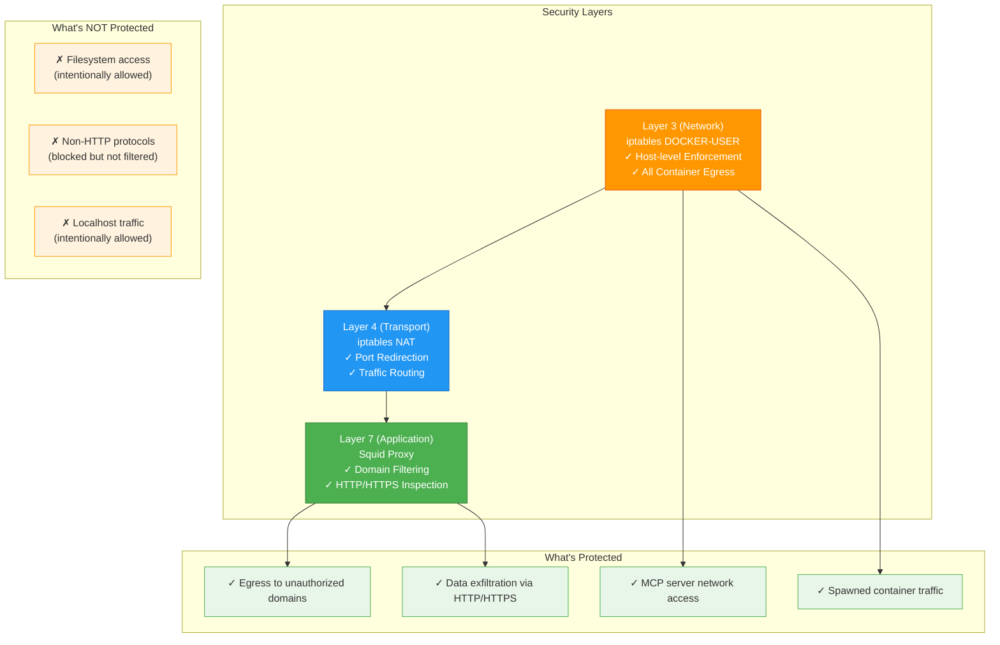
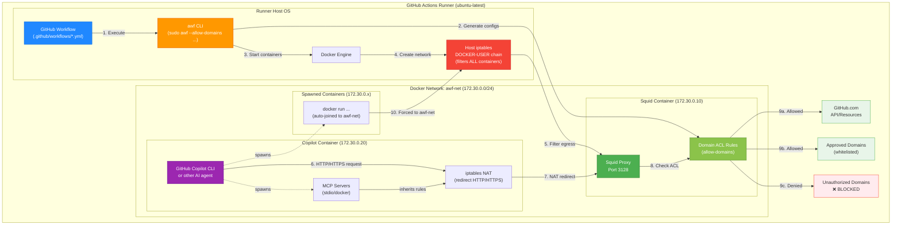
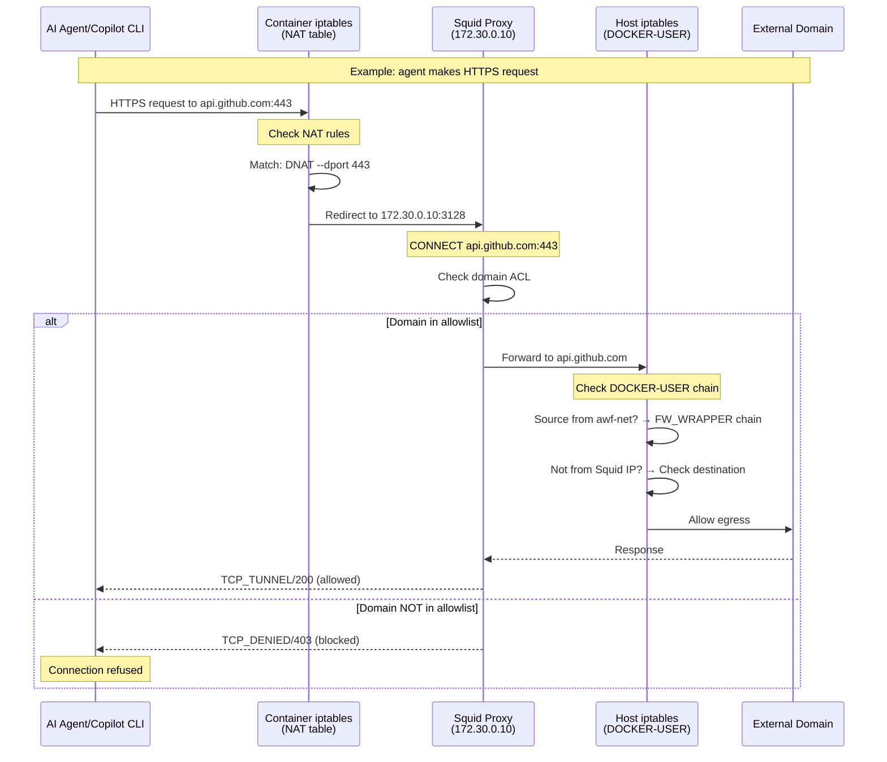
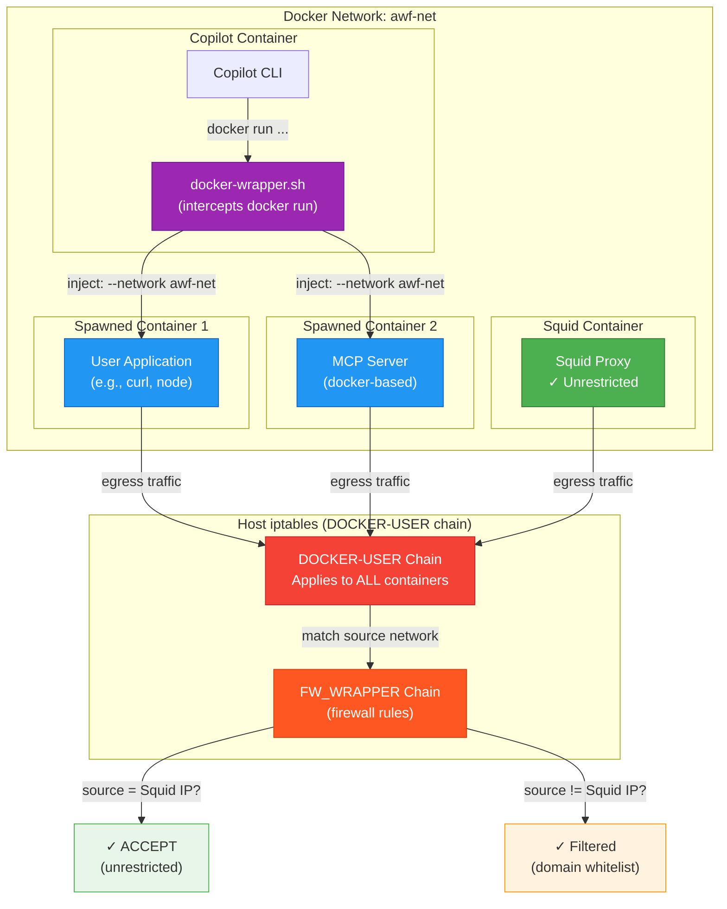
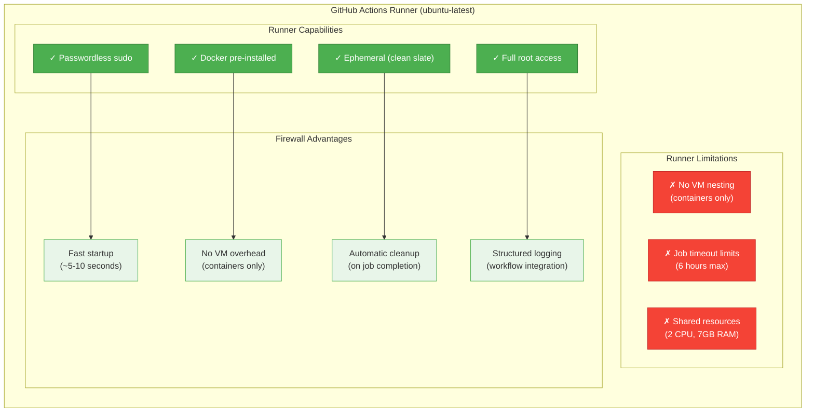
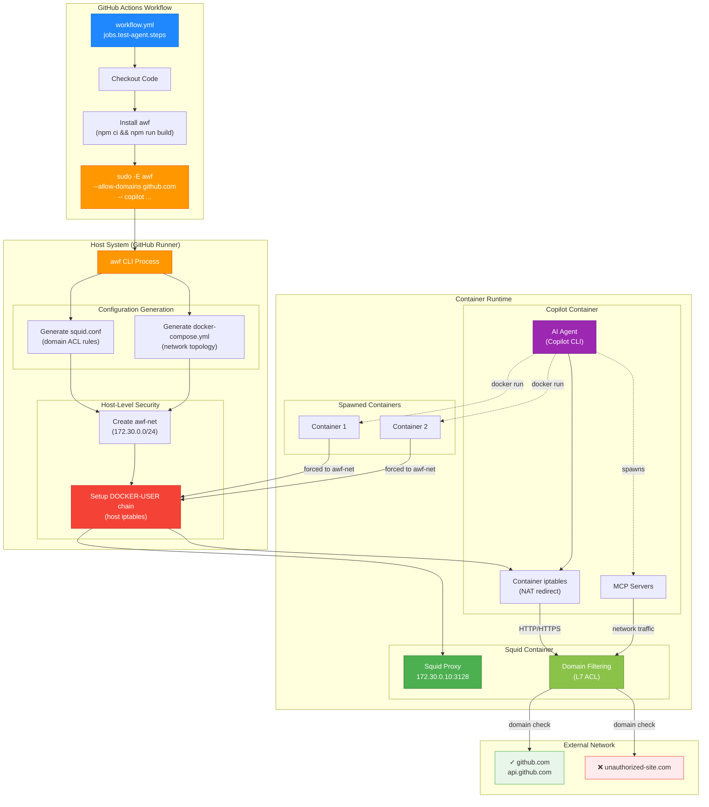
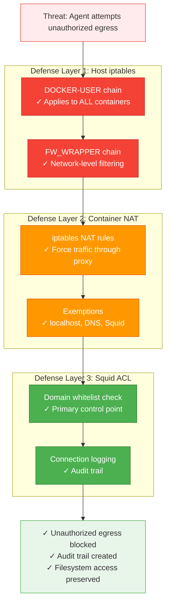

This page illustrates the security boundary and architecture of the Agentic Workflow Firewall, with a focus on GitHub Actions deployment scenarios.

## Security Boundary Overview

The firewall operates at **Layer 7 (Application Layer)** for HTTP/HTTPS traffic, providing domain-based filtering while allowing full filesystem access. Security is enforced at multiple layers using both host-level and container-level controls.



:::note[Design Philosophy]
The firewall prioritizes **egress control** (outbound network traffic) while maintaining **full filesystem access** for AI agents. This allows agents to read/write files on the host while restricting which external services they can communicate with.
:::

## GitHub Actions Deployment Architecture

The firewall is designed specifically for **GitHub Actions runners**, where it provides security boundaries for agentic workflows running in CI/CD pipelines.



:::tip[Best Practice]
The firewall is **optimized for GitHub Actions** where:
- Runners have full sudo access (no password required)
- Docker is pre-installed on ubuntu-latest runners
- Ephemeral environment enables aggressive cleanup
- Structured logging integrates with workflow logs
:::

## Traffic Flow with Security Enforcement

This diagram shows how a typical HTTP/HTTPS request flows through the security layers:



:::caution[Multi-Layer Enforcement]
Traffic must pass through **three security checkpoints**:
1. **Container iptables NAT** - Redirects HTTP/HTTPS to proxy
2. **Squid ACL** - Filters by domain whitelist (primary control)
3. **Host iptables DOCKER-USER** - Ensures ALL containers on awf-net follow rules

This defense-in-depth approach prevents bypass attempts.
:::

## Docker-in-Docker Security Propagation

The firewall automatically enforces restrictions on containers spawned by the AI agent through Docker-in-Docker:



:::tip[Automatic Network Injection]
The `docker-wrapper.sh` script intercepts ALL `docker run` commands and automatically:
- Injects `--network awf-net` to join the firewall network
- Injects proxy environment variables (`HTTP_PROXY`, `HTTPS_PROXY`)
- Ensures spawned containers inherit firewall restrictions

This happens transparently—no code changes needed in the AI agent or MCP servers.
:::

## Enforcement Mechanisms Comparison

The firewall uses different enforcement mechanisms for different types of traffic:

| Traffic Type | Enforcement Method | Security Layer | Notes |
|--------------|-------------------|----------------|-------|
| **HTTP (port 80)** | iptables NAT → Squid ACL | L4 + L7 | Full domain filtering |
| **HTTPS (port 443)** | iptables NAT → Squid CONNECT | L4 + L7 | SNI-based filtering (no SSL inspection) |
| **DNS (port 53)** | Allowed (required for resolution) | L4 | UDP/TCP port 53 exempted |
| **Localhost** | Allowed (stdio MCP servers) | L4 | 127.0.0.0/8 exempted |
| **Other protocols** | Blocked (logged) | L3 | iptables DOCKER-USER DROP |
| **Squid egress** | Unrestricted | L3 | Source IP exemption (172.30.0.10) |

:::note[No SSL Inspection]
The firewall uses Squid's CONNECT method for HTTPS traffic, which inspects the SNI (Server Name Indication) in the TLS handshake but **does NOT decrypt** the traffic. This provides domain filtering while maintaining end-to-end encryption.
:::

## GitHub Actions Runner Context

The firewall is **optimized for GitHub Actions runners** with these characteristics:



:::tip[Why GitHub Actions?]
The firewall is **purpose-built for GitHub Actions** because:
- **sudo access**: Required for iptables manipulation, available by default on runners
- **Docker available**: Runs containers without additional VM overhead
- **Ephemeral**: Clean environment prevents resource leaks across jobs
- **Structured logs**: Integrates seamlessly with workflow logging and artifacts
:::

## Complete System Architecture

This diagram shows the end-to-end architecture from GitHub Actions workflow to filtered network traffic:



## Security Enforcement Points

The firewall implements **defense-in-depth** with multiple enforcement points:

### 1. Host-Level Enforcement (DOCKER-USER Chain)

**Location**: Host iptables DOCKER-USER chain  
**Scope**: ALL containers on the `awf-net` network  
**Purpose**: Prevent bypass attempts via container spawning

```bash
# Host iptables rules (simplified)
iptables -A DOCKER-USER -i fw-bridge -j FW_WRAPPER   # Route awf-net traffic
iptables -A FW_WRAPPER -s 172.30.0.10 -j ACCEPT      # Allow Squid unrestricted
iptables -A FW_WRAPPER -p udp --dport 53 -j ACCEPT   # Allow DNS
iptables -A FW_WRAPPER -p tcp -d 172.30.0.10 --dport 3128 -j ACCEPT  # Allow proxy
iptables -A FW_WRAPPER -j DROP                        # Block everything else
```

:::danger[Critical Security Point]
The DOCKER-USER chain is **required** for security. Without it, spawned containers could bypass firewall by setting custom `--network` flags. The docker-wrapper ensures all spawned containers join `awf-net` where host-level filtering applies.
:::

### 2. Container-Level Redirection (NAT)

**Location**: Copilot container iptables NAT table  
**Scope**: Traffic originating from copilot container  
**Purpose**: Redirect HTTP/HTTPS to Squid proxy

```bash
# Container NAT rules (simplified)
iptables -t nat -A OUTPUT -o lo -j RETURN                    # Allow localhost
iptables -t nat -A OUTPUT -p udp --dport 53 -j RETURN        # Allow DNS
iptables -t nat -A OUTPUT -d 172.30.0.10 -j RETURN           # Allow to Squid
iptables -t nat -A OUTPUT -p tcp --dport 80 -j DNAT \        # Redirect HTTP
  --to-destination 172.30.0.10:3128
iptables -t nat -A OUTPUT -p tcp --dport 443 -j DNAT \       # Redirect HTTPS
  --to-destination 172.30.0.10:3128
```

### 3. Application-Level Filtering (Squid ACL)

**Location**: Squid proxy process  
**Scope**: HTTP/HTTPS requests passing through proxy  
**Purpose**: Domain whitelist enforcement (primary security control)

```squid
# Squid ACL rules (simplified)
acl allowed_domains dstdomain .github.com github.com
acl SSL_ports port 443
acl CONNECT method CONNECT

http_access deny CONNECT !SSL_ports    # Only HTTPS on 443
http_access allow allowed_domains      # Allow whitelisted domains
http_access deny all                   # Deny everything else
```

:::note[Primary Control Point]
While the firewall has three enforcement layers, **Squid ACL** is the primary control point for domain filtering. The iptables rules (host and container level) ensure traffic reaches Squid and prevent bypass attempts.
:::

## Platform Comparison

While the firewall **can** run on any Linux system with Docker, it's **optimized for GitHub Actions**:

| Platform | Compatibility | Optimal? | Notes |
|----------|--------------|----------|-------|
| **GitHub Actions (ubuntu-latest)** | ✅ Full | ✅ Yes | Passwordless sudo, pre-installed Docker, ephemeral |
| **GitHub Actions (ubuntu-22.04)** | ✅ Full | ✅ Yes | Same as ubuntu-latest (currently 22.04) |
| **GitHub Actions (ubuntu-20.04)** | ✅ Full | ⚠️ Older | Works but older packages |
| **Local Linux (sudo)** | ✅ Full | ⚠️ Manual cleanup | Works but requires manual cleanup between runs |
| **Local macOS** | ❌ No | ❌ No | iptables not available (requires Linux kernel) |
| **Local Windows (WSL2)** | ⚠️ Partial | ❌ No | iptables in WSL2 has limitations |
| **Self-hosted runners** | ✅ Full | ⚠️ Varies | Depends on runner configuration (sudo, Docker) |

:::caution[Local Development Limitations]
Running locally requires:
- Manual cleanup between runs (orphaned containers/networks)
- sudo password entry (unlike GitHub Actions)
- Potential conflicts with existing Docker networks
- Manual log collection and analysis

**Recommendation**: Use GitHub Actions for production workflows, local only for development/testing.
:::

## Security Model Summary

The firewall enforces security through a **layered approach**:



**Key Security Properties**:
- ✅ **Defense-in-depth**: Multiple layers prevent single-point-of-failure
- ✅ **Fail-secure**: If Squid fails, iptables blocks traffic (no bypass)
- ✅ **Transparent enforcement**: No agent code changes required
- ✅ **Audit trail**: All traffic logged (allowed and blocked)
- ✅ **Filesystem access**: Agents can read/write local files (by design)

:::danger[Security Assumptions]
This firewall assumes:
- **Trusted filesystem**: Agents can read/write ALL host files
- **Trusted code execution**: Agents can execute arbitrary code in containers
- **Network-only threat**: Protection focuses on egress, not code execution
- **Docker daemon trust**: Docker socket access grants significant privileges

If your threat model requires restricting filesystem access or code execution, **additional controls** are needed beyond this firewall.
:::

## Deployment Workflow

A typical GitHub Actions workflow using the firewall:

```mermaid
sequenceDiagram
    participant GH as GitHub Actions
    participant Runner as Runner (ubuntu-latest)
    participant AWF as awf CLI
    participant Docker as Docker Engine
    participant Squid as Squid Container
    participant Copilot as Copilot Container
    participant Agent as AI Agent
    
    GH->>Runner: Start workflow job
    Runner->>Runner: Checkout code
    Runner->>Runner: npm ci && npm run build
    Runner->>AWF: sudo -E awf --allow-domains github.com
    
    AWF->>AWF: Generate squid.conf
    AWF->>AWF: Generate docker-compose.yml
    AWF->>Docker: Create awf-net network
    AWF->>Docker: Setup DOCKER-USER iptables
    AWF->>Docker: docker compose up -d
    
    Docker->>Squid: Start squid-proxy container
    Squid->>Squid: Health check (wait for ready)
    Docker->>Copilot: Start copilot container (wait for Squid)
    Copilot->>Copilot: Setup container iptables NAT
    
    AWF->>Copilot: docker exec (run command)
    Copilot->>Agent: Execute AI agent command
    
    loop Agent makes requests
        Agent->>Copilot: HTTP/HTTPS request
        Copilot->>Squid: NAT redirect to proxy
        Squid->>Squid: Check domain ACL
        alt Domain allowed
            Squid->>Agent: Forward request and return response
        else Domain blocked
            Squid->>Agent: 403 Forbidden (TCP_DENIED)
        end
    end
    
    Agent->>Copilot: Exit with code
    AWF->>Docker: docker compose down -v
    AWF->>AWF: Cleanup temp files
    AWF->>Runner: Exit with agent's exit code
    Runner->>GH: Report job status
    
    style GH fill:#2088FF,stroke:#0969DA,color:#fff
    style AWF fill:#FF9800,stroke:#E65100,color:#fff
    style Squid fill:#4CAF50,stroke:#2E7D32,color:#fff
    style Agent fill:#9C27B0,stroke:#6A1B9A,color:#fff
```

## Best Practices for GitHub Actions

When deploying the firewall in GitHub Actions:

### ✅ DO

- **Use `sudo -E`** to preserve environment variables (e.g., `GITHUB_TOKEN`)
- **Pin runner to `ubuntu-latest`** for consistent Docker/iptables versions
- **Set reasonable timeouts** (5-15 minutes for typical workflows)
- **Use `--log-level debug`** for initial testing to troubleshoot domain issues
- **Store logs as artifacts** for debugging failed runs
- **Run cleanup in `always()` step** to prevent resource leaks

### ❌ DON'T

- **Don't use `runs-on: macos-*`** (iptables requires Linux kernel)
- **Don't use `runs-on: windows-*`** (iptables not available)
- **Don't skip cleanup steps** (causes network pool exhaustion)
- **Don't use `--keep-containers`** in CI (containers will accumulate)
- **Don't run parallel jobs** with firewall on same runner (port conflicts)

### Example GitHub Actions Workflow

```yaml
name: Test AI Agent with Firewall

on: [push, pull_request]

jobs:
  test-agent:
    runs-on: ubuntu-latest  # Required: Linux with Docker
    timeout-minutes: 10
    
    steps:
      - name: Checkout repository
        uses: actions/checkout@v4
      
      - name: Setup Node.js
        uses: actions/setup-node@v4
        with:
          node-version: '20'
      
      - name: Install firewall
        run: |
          npm ci
          npm run build
          sudo npm link
      
      - name: Run AI agent with firewall
        env:
          GITHUB_TOKEN: ${{ secrets.GITHUB_TOKEN }}
        run: |
          sudo -E awf \
            --allow-domains github.com,api.github.com,githubusercontent.com \
            --log-level debug \
            -- copilot --prompt "List my repositories"
      
      # Optional: Preserve logs on failure
      - name: Upload logs
        if: failure()
        uses: actions/upload-artifact@v4
        with:
          name: firewall-logs
          path: |
            /tmp/squid-logs-*
            /tmp/copilot-logs-*
      
      # Critical: Always cleanup
      - name: Cleanup
        if: always()
        run: |
          sudo docker compose down -v 2>/dev/null || true
          sudo docker network prune -f
```

:::tip[Testing Locally Before CI]
Always test firewall commands locally before adding to CI/CD:

```bash
# Local testing (interactive debugging)
# Note: --keep-containers is useful locally for inspection but should NOT be used in CI
# (in CI, it causes resource accumulation since containers aren't cleaned up between runs)
sudo -E awf \
  --allow-domains github.com \
  --log-level debug \
  --keep-containers \
  -- copilot --prompt "test prompt"

# Check logs after execution
sudo cat /tmp/squid-logs-*/access.log

# Remember to cleanup manually when using --keep-containers
sudo docker compose down -v
```

Once working locally, migrate to GitHub Actions workflow.
:::

## Related Documentation

- [Architecture Overview](/reference/architecture) - Detailed technical architecture
- [GitHub Actions Integration](/guides/github-actions) - Workflow examples and troubleshooting
- [Quick Start](/getting-started/quickstart) - Installation and basic usage
- [CLI Reference](/reference/cli-options) - Complete command-line options
